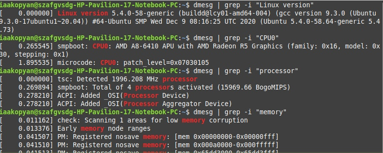
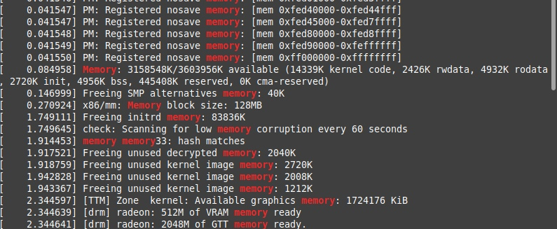
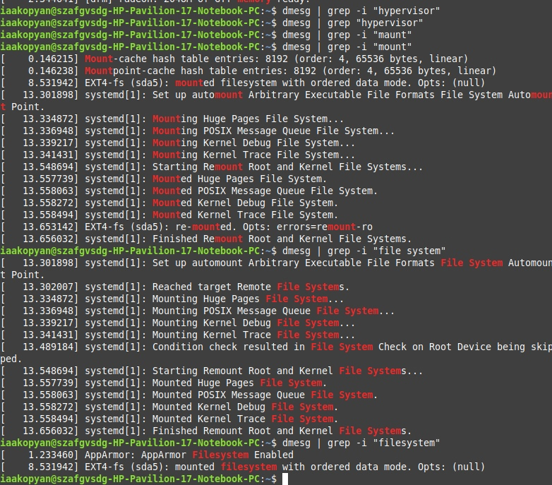
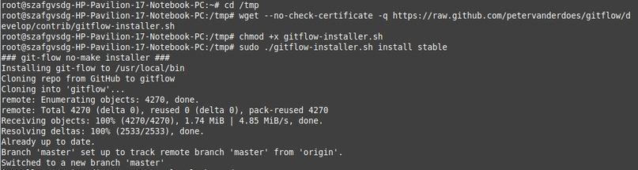
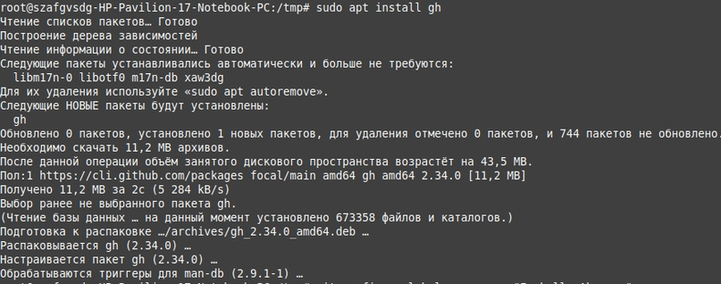
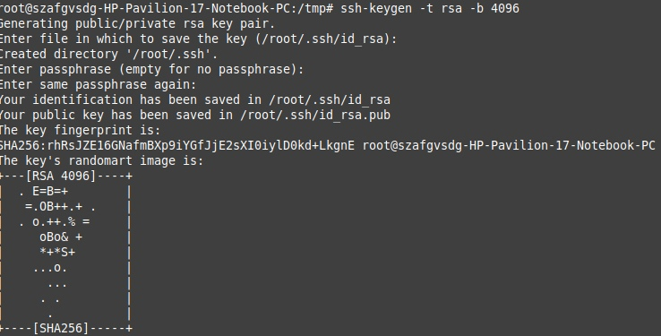
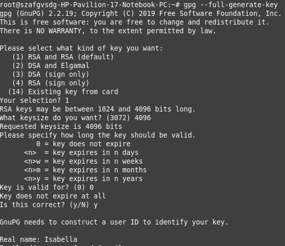
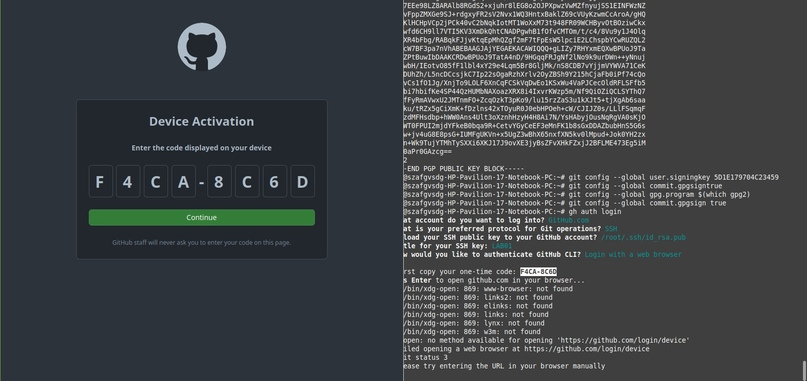
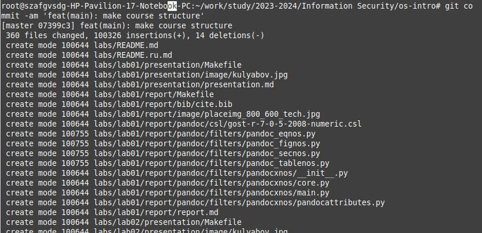
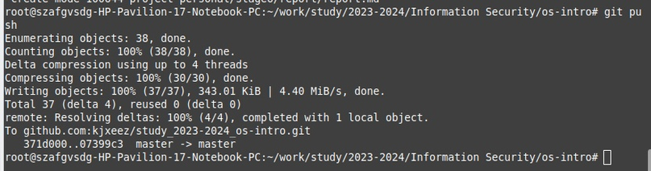

---
## Front matter
lang: ru-RU
title: Лабораторная работа №1
subtitle: Установка и конфигурация операционной системы на виртуальную машину. Управление версиями
author:
  - Акопян И.А.
institute:
  - Российский университет дружбы народов, Москва, Россия
date: 09 сентября 2023

## i18n babel
babel-lang: russian
babel-otherlangs: english

## Formatting pdf
toc: false
toc-title: Содержание
slide_level: 2
aspectratio: 169
section-titles: true
theme: metropolis
header-includes:
 - \metroset{progressbar=frametitle,sectionpage=progressbar,numbering=fraction}
 - '\makeatletter'
 - '\beamer@ignorenonframefalse'
 - '\makeatother'
---

# Информация

## Докладчик

  * Акопян Изабелла Арменовна
  * Бизнес-информатика
  * студент кафедры математического моделирования и ИИ
  * Российский университет дружбы народов
  * [1032203961@rudn.ru](mailto:1032203961@rudn.ru)

# Объект и предмет лабораторной работы

- git, средства контроля версиями
- работа с ОС Linux

# Цели и задачи

## 1
- Приобретение практических навыков установки операционной системы на виртуальную машину
- Настройка минимально необходимых для дальнейшей работы сервисов.

## 2
- Изучение идеологии и применения средств контроля версий.
- Освоение работы с git.

# Задание 1:

Получите следующую информацию:

1. Версия ядра Linux (Linux version).
2. Частота процессора (Detected Mhz processor).
3. Модель процессора (CPU0).
4. Объем доступной оперативной памяти (Memory available).
5. Тип обнаруженного гипервизора (Hypervisor detected).
6.  Тип файловой системы корневого раздела

# Работа с dmesg | grep (1/3)

- dmesg выводит очень много информации, поэтому используем его вкупе с grep, чтобы ограничить вывод данных

{#fig:001 width=70%}

# Работа с dmesg | grep (2/3)

{#fig:004 width=70%}

# Работа с dmesg | grep (3/3)

{#fig:006 width=70%}

# Задание 2:

- Создать базовую конфигурацию для работы с git.
- Создать ключ SSH.
- Создать ключ PGP.
- Настроить подписи git.
- Зарегистрироваться наGithub.
- Создать локальный каталог для выполнения заданий по предмету.

# Мой гитхаб

{#fig:008 width=70%}

# Установка git-flow и gh

{#fig:010 width=60%}

{#fig:011 width=60%}

# Получение ssh ключа

Создала ключ ssh для безопасного подключения к удаленным серверам через Интернет.

{#fig:013 width=70%}

# Получение pgp ключа

PGP использует приватный ключ, который должен храниться в секрете, и публичный ключ, который известен отправителю и получателю. 

{#fig:015 width=70%}

# Другая настройка гита

Используя введёный email,указала Git-у применять его при подписи коммитов и авторизовалась в ГХ хосте.
{#fig:017 width=70%}

# Отправка репозитория на гитхаб

Сохранила всё у себя

{#fig:021 width=50%}

# Отправка репозитория на гитхаб

{#fig:022 width=50%}

# Выводы

Я освежила в памяти работу с ОС Linux (поработала с правами пользователей, выводом буфера сообщений ядра и производила по нему поиск).

Также успешно повторила идеологию и применение средств контроля версий, создав репозиторий GH.

