---
## Front matter
title: "Лабораторная работа №1"
subtitle: "Установка и конфигурация операционной системы на виртуальную машину. Управление версиями"
author: "Акопян Изабелла Арменовна"

## Generic otions
lang: ru-RU
toc-title: "Содержание"

## Bibliography
bibliography: bib/cite.bib
csl: pandoc/csl/gost-r-7-0-5-2008-numeric.csl

## Pdf output format
toc: true # Table of contents
toc-depth: 2
lof: true # List of figures
lot: true # List of tables
fontsize: 12pt
linestretch: 1.5
papersize: a4
documentclass: scrreprt
## I18n polyglossia
polyglossia-lang:
  name: russian
  options:
	- spelling=modern
	- babelshorthands=true
polyglossia-otherlangs:
  name: english
## I18n babel
babel-lang: russian
babel-otherlangs: english
## Fonts
mainfont: PT Serif
romanfont: PT Serif
sansfont: PT Sans
monofont: PT Mono
mainfontoptions: Ligatures=TeX
romanfontoptions: Ligatures=TeX
sansfontoptions: Ligatures=TeX,Scale=MatchLowercase
monofontoptions: Scale=MatchLowercase,Scale=0.9
## Biblatex
biblatex: true
biblio-style: "gost-numeric"
biblatexoptions:
  - parentracker=true
  - backend=biber
  - hyperref=auto
  - language=auto
  - autolang=other*
  - citestyle=gost-numeric
## Pandoc-crossref LaTeX customization
figureTitle: "Рис."
tableTitle: "Таблица"
listingTitle: "Листинг"
lofTitle: "Список иллюстраций"
lotTitle: "Список таблиц"
lolTitle: "Листинги"
## Misc options
indent: true
header-includes:
  - \usepackage{indentfirst}
  - \usepackage{float} # keep figures where there are in the text
  - \floatplacement{figure}{H} # keep figures where there are in the text
---

# Цель работы

Целью данной работы является приобретение практических навыков установки 
операционной системы на виртуальную машину, настройки минимально необходимых 
для дальнейшей работы сервисов.

- Изучить идеологию и применение средств контроля версий.
- Освоить умения по работе с git.

# Задание

## Задание 1:

Получите следующую информацию:

1. Версия ядра Linux (Linux version).
2. Частота процессора (Detected Mhz processor).
3. Модель процессора (CPU0).
4. Объем доступной оперативной памяти (Memory available).
5. Тип обнаруженного гипервизора (Hypervisor detected).
6.  Тип файловой системы корневого раздела

## Задание 2:

- Создать базовую конфигурацию для работы с git.
- Создать ключ SSH.
- Создать ключ PGP.
- Настроить подписи git.
- Зарегистрироваться наGithub.
- Создать локальный каталог для выполнения заданий по предмету.

# Теоретическое введение

В данной лабораторной работе я буду использовать команду grep для поиска определенных строк в выводе команды dmesg. Команда grep позволяет искать строки по заданному шаблону, который включает в себя ключевые слова или выражения. 

Также буду работать с git.

Система контроля версий Git представляет собой набор программ командной строки. Доступ к ним можно получить из терминала посредством ввода команды git с различными опциями. Она предоставляет возможность фиксировать, объединять, отслеживать и разрешать конфликты, возникающие при работе нескольких людей над одним файлом.

Основная идея заключается в том, что каждый участник команды имеет свой собственный репозиторий, где он хранит все необходимые файлы и работает над ними независимо друг от друга. Когда один участник вносит изменения в проект, эти изменения сохраняются автоматически или вручную, если это необходимо. Если изменения были внесены другим участником, то они также сохраняются автоматически или вручную, если это необходимо.

Распределенные системы контроля версий (Git, Bazaar, Mercurial) — это одна из самых популярных систем контроля версий. Они основаны на принципе децентрализации, когда каждый участник команды имеет свой собственный репозиторий. Это означает, что каждый участник может хранить свою собственную копию проекта и работать над ней независимо друг от друга.

# Выполнение лабораторной работы

## Задание №1

Здесь я работаю с командой dmesg|grep -i, dmesg выводит очень много информации, поэтому используем его вкупе с grep, чтобы ограничить вывод данных.

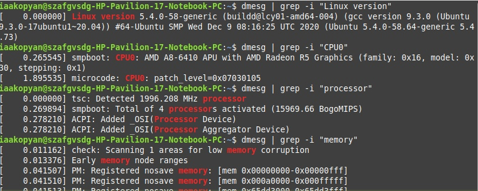{#fig:001 width=70%}

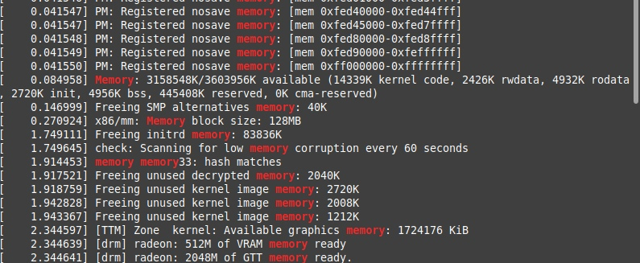{#fig:004 width=70%}

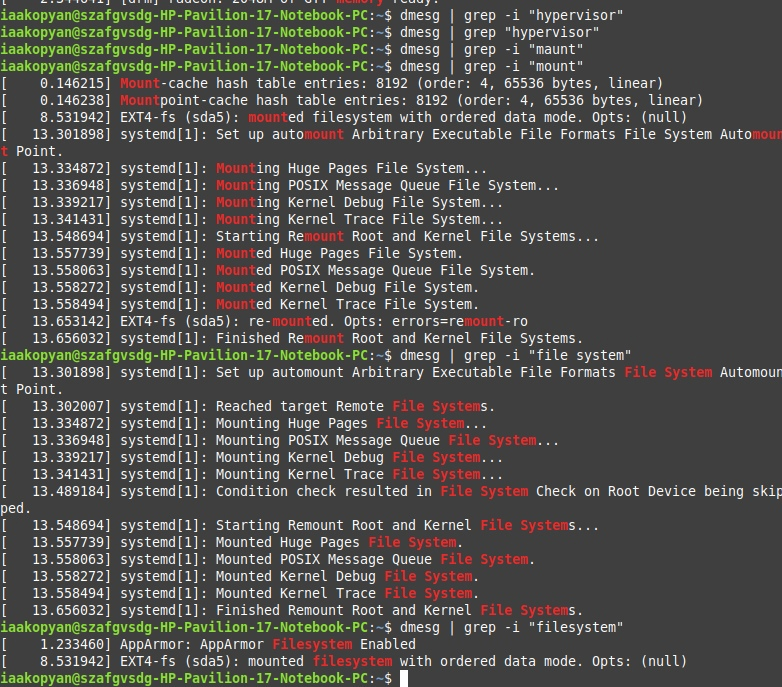{#fig:006 width=70%}

## Задание №2

Мой гитхаб уже был настроен, единственное подписала имя iaakopyan.

{#fig:008 width=70%}

У данной учетной записи Линукса нет прав на работу с sudo, поэтому заменила пользователя с помощью команды su - на пользователя root.(рис. @fig:009).

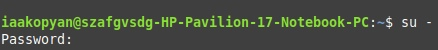{#fig:009 width=70%}

Установила git-flow вручную

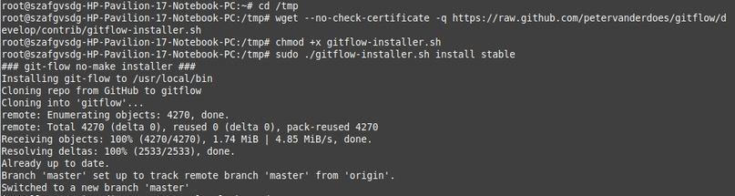{#fig:010 width=70%}

И установила gh, но с помощью команды apt, так как у меня Ubuntu.

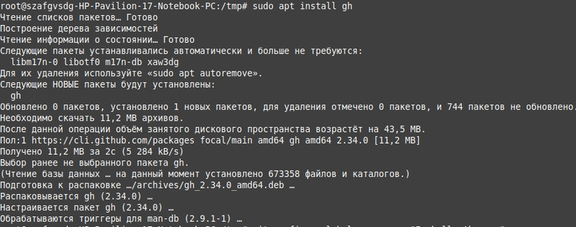{#fig:011 width=70%}

Произвела настройку гита, задала своё имя и почту, вывод сообщений, верификацию и ветку. (рис. @fig:012).

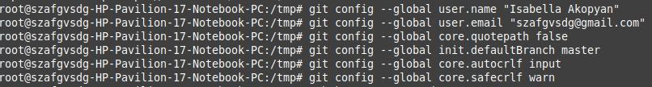{#fig:012 width=70%}

Создала ключ ssh для безопасного подключения к удаленным серверам через Интернет.

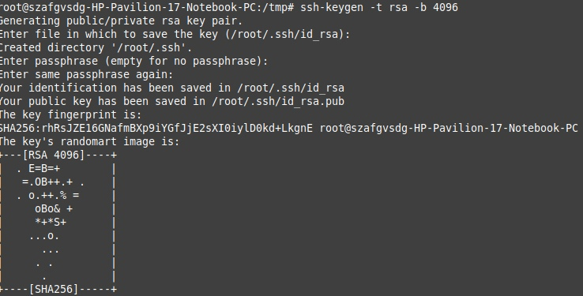{#fig:013 width=70%}

Вот мой гениально зашифрованный ключ

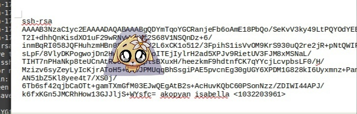{#fig:014 width=70%}

Теперь нужно получить новый ключ pgp rsa. PGP использует приватный ключ, который должен храниться в секрете, и публичный ключ, который известен отправителю и получателю. 

{#fig:015 width=70%}

Вот второй ключ

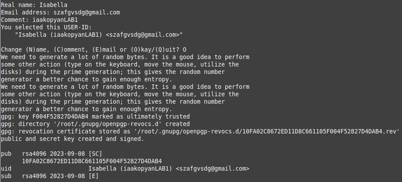{#fig:016 width=70%}

Используя введёный email,указала Git-у применять его при подписи коммитов и авторизовалась в ГХ хосте.

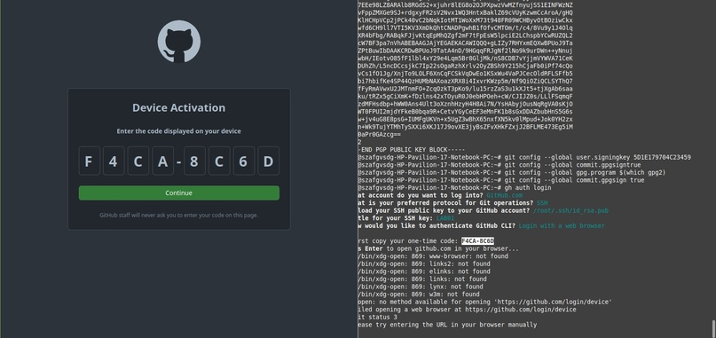{#fig:017 width=70%}

Создала новый репозиторий, автоматом назвала его как ОС, а не ИБ.

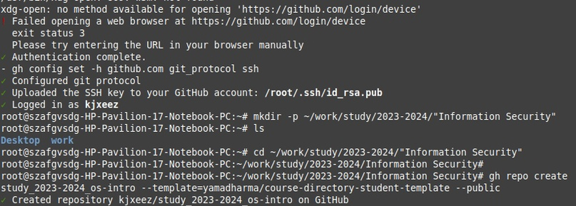{#fig:018 width=70%}

Клонировала репозиторий с гитхаба

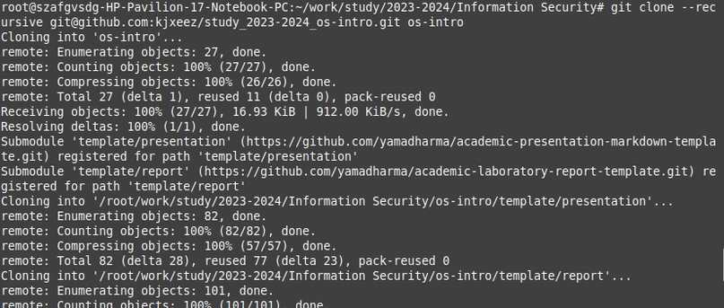{#fig:019 width=70%}

Удалила лишнее в каталоге курса и создала, как говорится, нужное. 

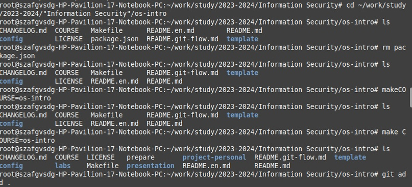{#fig:020 width=70%}

Сохранила всё у себя

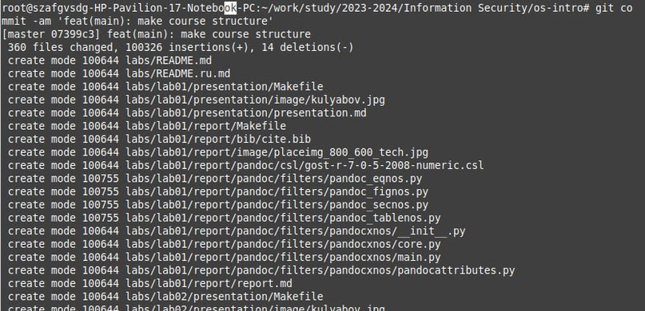{#fig:021 width=70%}

Отправила в гитхаб

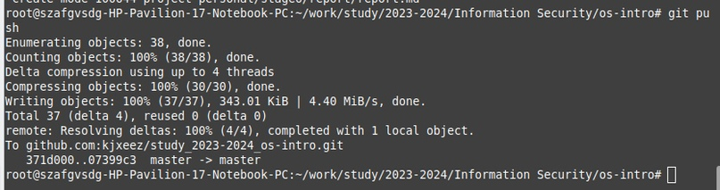{#fig:022 width=70%}

# Выводы

Я освежила в памяти работу с ОС Linux (поработала с правами пользователей, выводом буфера сообщений ядра и производила по нему поиск).

Также успешно повторила идеологию и применение средств контроля версий, создав репозиторий GH.

# Список литературы{.unnumbered}

### [Форум по Linux](https://askubuntu.com/)

### [Команды Git - Основные команды](https://git-scm.com/book/ru/v2/%D0%9F%D1%80%D0%B8%D0%BB%D0%BE%D0%B6%D0%B5%D0%BD%D0%B8%D0%B5-C%3A-%D0%9A%D0%BE%D0%BC%D0%B0%D0%BD%D0%B4%D1%8B-Git-%D0%9E%D1%81%D0%BD%D0%BE%D0%B2%D0%BD%D1%8B%D0%B5-%D0%BA%D0%BE%D0%BC%D0%B0%D0%BD%D0%B4%D1%8B)
