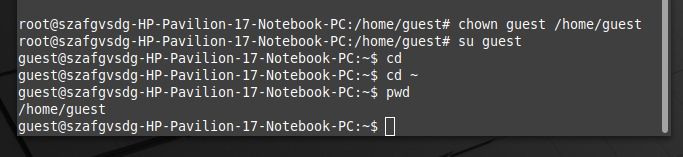
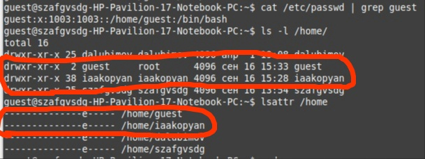
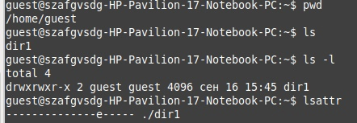
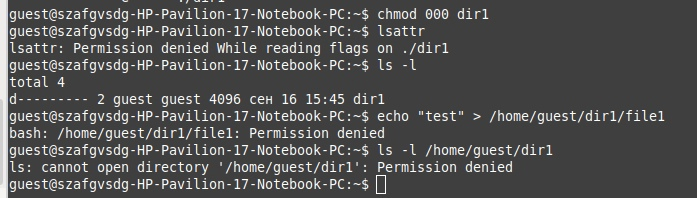
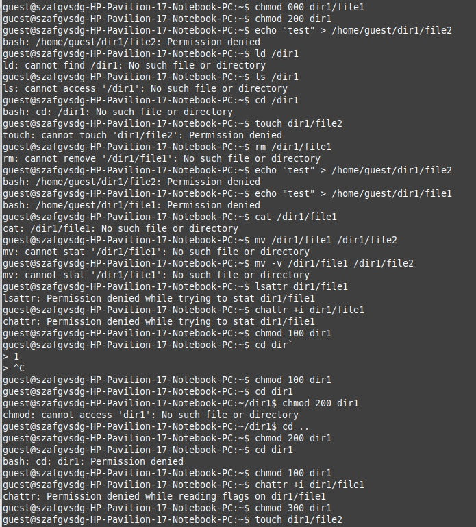

---
## Front matter
lang: ru-RU
title: Лабораторная работа №2
subtitle: Дискреционное разграничение прав в Linux. Основные атрибуты
author:
  - Акопян И.А.
institute:
  - Российский университет дружбы народов, Москва, Россия
date: 16 сентябрь 2023

## i18n babel
babel-lang: russian
babel-otherlangs: english

## Formatting pdf
toc: false
toc-title: Содержание
slide_level: 2
aspectratio: 169
section-titles: true
theme: metropolis
header-includes:
 - \metroset{progressbar=frametitle,sectionpage=progressbar,numbering=fraction}
 - '\makeatletter'
 - '\beamer@ignorenonframefalse'
 - '\makeatother'
---

# Информация

## Докладчик

:::::::::::::: {.columns align=center}
::: {.column width="70%"}
### 
  * Акопян Изабелла Арменовна
  * Бизнес-информатика
  * Кафедра математического моделирования и ИИ
  * Российский университет дружбы народов
  * 1032203961@pfur.ru
  * <https://github.com/kjxeez>

:::
::: {.column width="30%"}
:::
::::::::::::::


# Цель работы

Получение практических навыков работы в консоли с атрибутами файлов, закрепление теоретических основ дискреционного разграничения доступа в современных системах с открытым кодом на базе ОС Linux.

# Задание

 - Создайте учётную запись пользователя guest

 - Уточните информацию о пользователе

 - Заполните таблицу "Установленные права и разрешённые действия"

 - Заполните таблицу "Минимальные права для совершения операций"


# Выполнение лабораторной работы

Начала с создания нового пользователя. Установила ему пароль. (рис. @fig:001).

{#fig:001 width=70%}

# 
Мне пришлось вручную создавать директорию для учетной записи, поэтому передала эту директорию пользователю с помощью команды chmod. (рис. @fig:002)

{#fig:003 width=70%}

# 

Просмотрела файл/etc/passwd командой cat /etc/passwd | grep guest (рис. @fig:003 - рис. @fig:004 )

{#fig:004 width=70%} 

# 

Создала новый каталог и определила права доступа и атрибуты (рис. @fig:004-@fig:005)

{#fig:006 width=70%}

# 

Сняла с директории dir1 все атрибуты и проверила правильность команды. Попыталась создать файл, но не вышло, тк нет прав на создание файла в директории. Ничего не создалось(рис. @fig:007).

{#fig:007 width=70%}

# 

Далее я начала заполнять таблицу "Установленные права и разрешённые действия". На (рис. @fig:008) показано как я сменяю права к директории и файлу и, можно сказать, провожу тест, чтобы понять на что повлияла смена прав. И так делаю много раз, чтобы заполнить таблицу

{#fig:008 width=40%}


# Минимальные права для совершения операций

|Операция|Права на директорию|Права на файл|
|:---:|:---:|:---:|
|Создание файла|```d-wx------ (300)```|```---------- (000)```|
|Удаление файла|```d-wx------ (300)```|```---------- (000)```|
|Чтение файла|```d--x------ (100)```|```-r-------- (400)```|
|Запись в файл|```d--x------ (100)```|```--w------- (200)```|
|Переименование файла|```d-wx------ (300)```|```----------(000)```|
|Создание поддиректории|```d-wx------ (300)```|```---------- (000)```|
|Удаление поддиректории|```d-wx------ (300)```|```---------- (000)```|

# Выводы

1. Я получила практические навыки работы в консоли с атрибутами файлов, закрепила теоретические основы дискреционного разграничения доступа в современных системах с открытым кодом на базе ОС Linux.

2. Заполнила таблицы «Установленные права и разрешённые действия» и «Минимально необходимые права для выполнения операций внутри директории».
