---
## Front matter
title: "Лабораторная работа №2"
subtitle: "Дискреционное разграничение прав в Linux. Основные атрибуты"
author: "Акопян Изабелла Арменовна"

## Generic otions
lang: ru-RU
toc-title: "Содержание"

## Bibliography
bibliography: bib/cite.bib
csl: pandoc/csl/gost-r-7-0-5-2008-numeric.csl

## Pdf output format
toc: true # Table of contents
toc-depth: 2
lof: true # List of figures
lot: true # List of tables
fontsize: 12pt
linestretch: 1.5
papersize: a4
documentclass: scrreprt
## I18n polyglossia
polyglossia-lang:
  name: russian
  options:
	- spelling=modern
	- babelshorthands=true
polyglossia-otherlangs:
  name: english
## I18n babel
babel-lang: russian
babel-otherlangs: english
## Fonts
mainfont: PT Serif
romanfont: PT Serif
sansfont: PT Sans
monofont: PT Mono
mainfontoptions: Ligatures=TeX
romanfontoptions: Ligatures=TeX
sansfontoptions: Ligatures=TeX,Scale=MatchLowercase
monofontoptions: Scale=MatchLowercase,Scale=0.9
## Biblatex
biblatex: true
biblio-style: "gost-numeric"
biblatexoptions:
  - parentracker=true
  - backend=biber
  - hyperref=auto
  - language=auto
  - autolang=other*
  - citestyle=gost-numeric
## Pandoc-crossref LaTeX customization
figureTitle: "Рис."
tableTitle: "Таблица"
listingTitle: "Листинг"
lofTitle: "Список иллюстраций"
lotTitle: "Список таблиц"
lolTitle: "Листинги"
## Misc options
indent: true
header-includes:
  - \usepackage{indentfirst}
  - \usepackage{float} # keep figures where there are in the text
  - \floatplacement{figure}{H} # keep figures where there are in the text
---

# Цель работы

Получение практических навыков работы в консоли с атрибутами файлов, закрепление теоретических основ дискреционного разграничения доступа в современных системах с открытым кодом на базе ОС Linux.

# Задание

 - Создайте учётную запись пользователя guest

 - Уточните информацию о пользователе

 - Заполните таблицу "Установленные права и разрешённые действия"

 - Заполните таблицу "Минимальные права для совершения операций"

# Теоретическое введение

В самом начале использую команду useradd, чтобы создать нового пользователя. В Linux команда «useradd» — это утилита низкого уровня, которая используется для добавления/создания учетных записей пользователей в Linux и других Unix-подобных операционных системах. 

В данной лабораторной работе я в основном работаю с командой chmod, это команда для изменения прав доступа к файлам и каталогам.

Есть 3 вида разрешений. Они определяют права пользователя на 3 действия: чтение, запись и выполнение. В Linux эти действия обозначаются вот так:

    - r — read (чтение) — право просматривать содержимое файла;
    - w — write (запись) — право изменять содержимое файла;
    - x — execute (выполнение) — право запускать файл, если это программа или скрипт.

У каждого файла есть 3 группы пользователей, для которых можно устанавливать права доступа. 

    - owner (владелец) — отдельный человек, который владеет файлом. Обычно это тот, кто создал файл, но владельцем можно сделать и кого-то другого.
    - group (группа) — пользователи с общими заданными правами.
    - others (другие) — все остальные пользователи, не относящиеся к группе и не являющиеся владельцами. 

В данной лабораторной мы работаем в основном только с правами для владельца.

# Выполнение лабораторной работы

Начала с создания нового пользователя. Установила ему пароль. (рис. @fig:001).

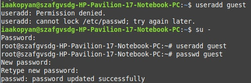{#fig:001 width=70%}

Мне пришлось вручную создавать директорию для учетной записи, поэтому передала эту директорию пользователю с помощью команды chmod. (рис. @fig:002)

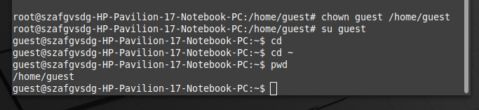{#fig:002 width=70%}

Просмотрела файл/etc/passwd командой cat /etc/passwd | grep guest (рис. @fig:003 - рис. @fig:004 )

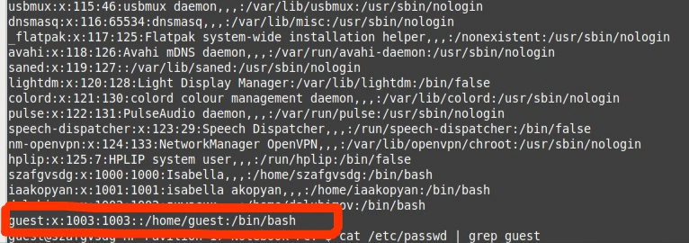{#fig:003 width=70%} 

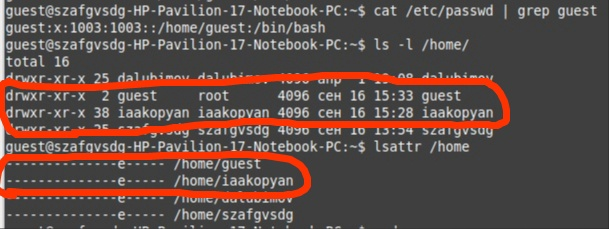{#fig:004 width=70%} 

Создала новый каталог и определила права доступа и атрибуты (рис. @fig:004-@fig:005)

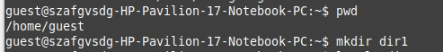{#fig:005 width=70%}

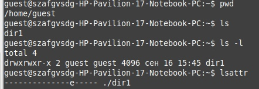{#fig:006 width=70%}

Сняла с директории dir1 все атрибуты и проверила правильность команды. Попыталась создать файл, но не вышло, тк нет прав на создание файла в директории. Ничего не создалось(рис. @fig:007).

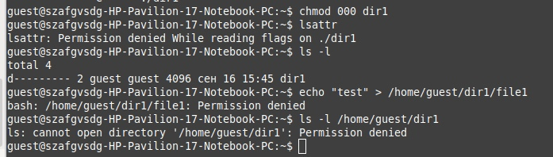{#fig:007 width=70%}

Далее я начала заполнять таблицу "Установленные права и разрешённые действия". На (рис. @fig:008 - рис. @fig:009) показано как я сменяю права к директории и файлу и, можно сказать, провожу тест, чтобы понять на что повлияла смена прав. И так делаю много раз, чтобы заполнить таблицу

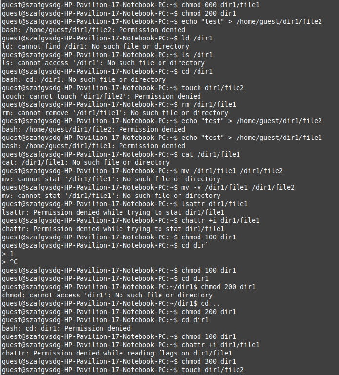{#fig:008 width=70%}

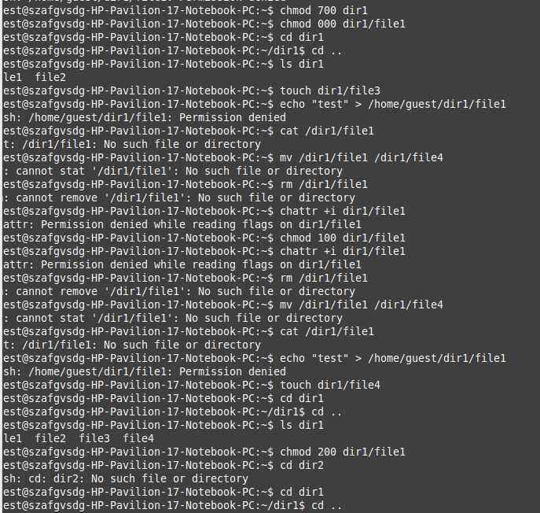{#fig:009 width=70%}

Получившиеся таблицы с правами (рис. @fig:010 - рис. @fig:012)

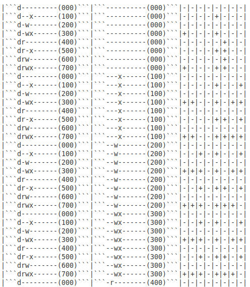{#fig:010 width=70%}

Информация по столбцам: права директории, права файла, создание файла, удаление файла, запись в файл, чтение файла, смена директории, просмотр файлов в директории, переименование файла, смена атрибутов файла.

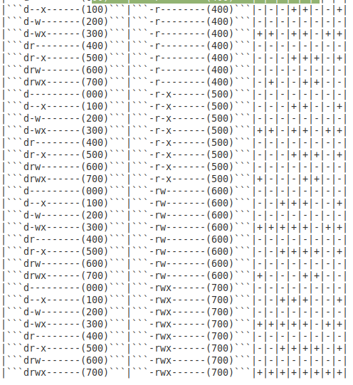{#fig:011 width=70%}

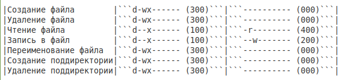{#fig:012 width=70%}

# Выводы

Я получила практические навыки работы в консоли с атрибутами файлов, закрепила теоретические основы дискреционного разграничения доступа в современных системах с открытым кодом на базе ОС Linux.

# Список литературы{.unnumbered}

::: {#refs}
:::
