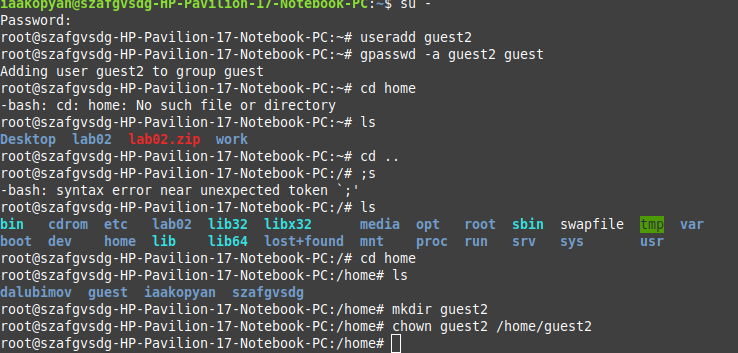
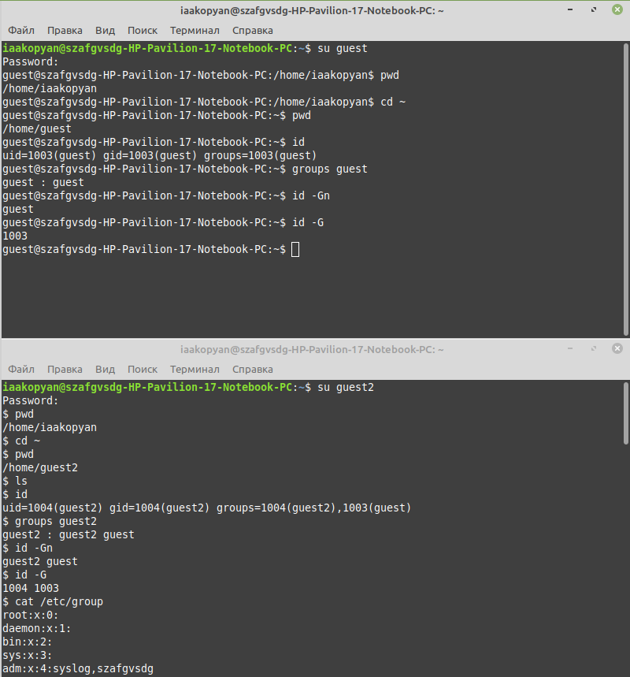
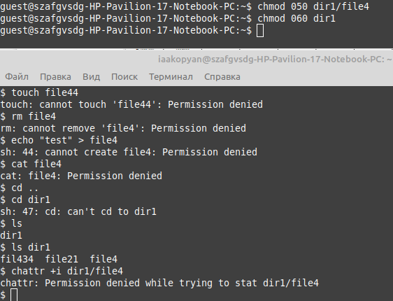
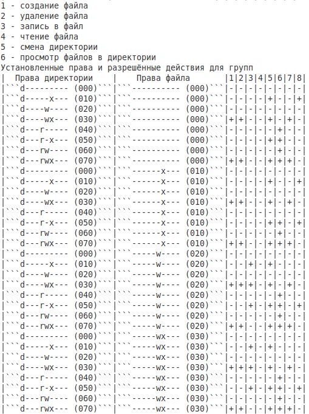
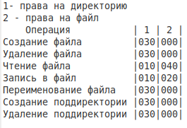

---
## Front matter
lang: ru-RU
title: Лабораторная работа №3
subtitle: Дискреционное разграничение прав в Linux. Два пользователя
author:
  - Акопян И.А.
institute:
  - Российский университет дружбы народов, Москва, Россия
date: 23 сентября 2023

## i18n babel
babel-lang: russian
babel-otherlangs: english

## Formatting pdf
toc: false
toc-title: Содержание
slide_level: 2
aspectratio: 169
section-titles: true
theme: metropolis
header-includes:
 - \metroset{progressbar=frametitle,sectionpage=progressbar,numbering=fraction}
 - '\makeatletter'
 - '\beamer@ignorenonframefalse'
 - '\makeatother'
---

# Информация

## Докладчик

:::::::::::::: {.columns align=center}
::: {.column width="70%"}
### 
  * Акопян Изабелла Арменовна
  * Бизнес-информатика
  * Кафедра математического моделирования и ИИ
  * Российский университет дружбы народов
  * 1032203961@pfur.ru
  * <https://github.com/kjxeez>

:::
::: {.column width="30%"}
:::
::::::::::::::

# Вводная часть

# Цель работы

Получение практических навыков работы в консоли с атрибутами файлов для групп пользователей.

# Задание

 - Создайте учётную запись пользователя guest2

 - Уточните информацию о пользователе

 - Заполните таблицу "Установленные права и разрешённые действия для групп"

 - Заполните таблицу "Минимальные права для совершения операций от имени пользователей входящих в группу"

# Выполнение лабораторной работы

Начала с создания нового пользователя. Установила ему пароль.

{#fig:001 width=70%}

# 

{#fig:002 width=70%}

# 

{#fig:005 width=70%} 

# 

{#fig:006 width=70%}

# 
На основании заполненной таблицы выше определила те или иные минимально необходимые права для выполнения пользователем guest2 операций внутри директории dir1 и заполнила таблицу

{#fig:008 width=70%} 

# Выводы

1. В ходе лабораторной работы мне удалось получить практические навыки работы в консоли с атрибутами файлов для групп пользователей и заполнить две табицы с правами пользователей в группе.

2. Заполнила таблицы «Установленные права и разрешённые действия» и «Минимально необходимые права для выполнения операций внутри директории».

