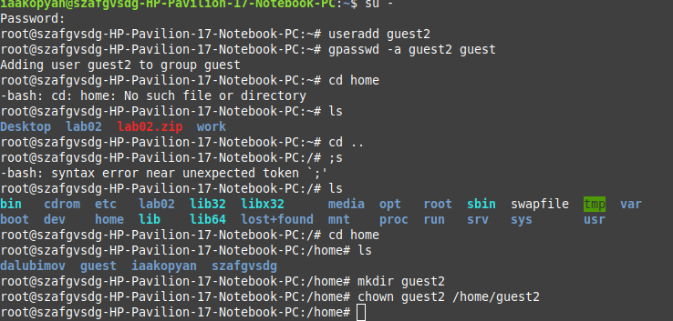
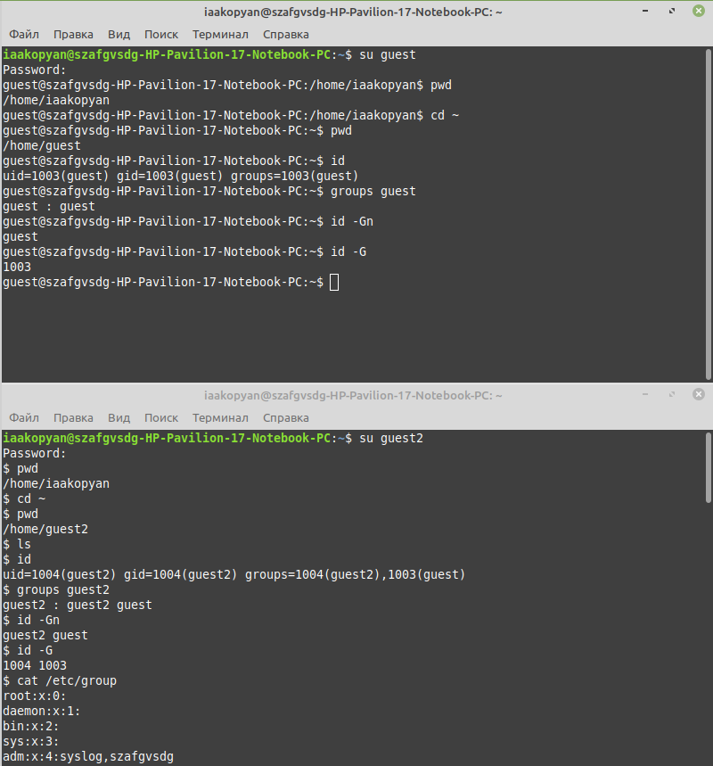
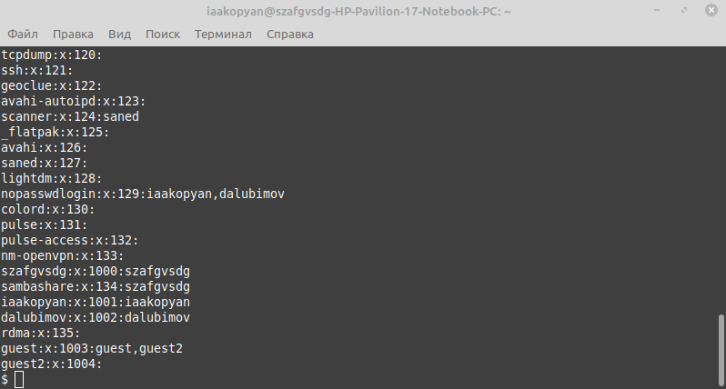
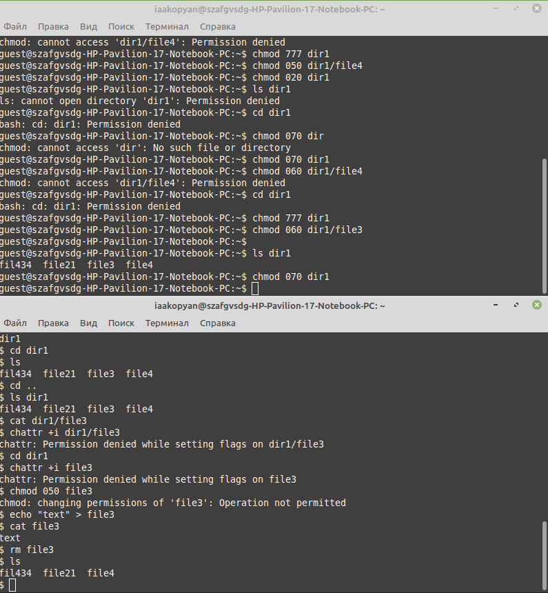
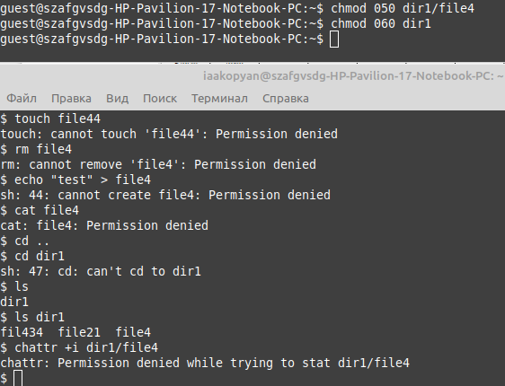
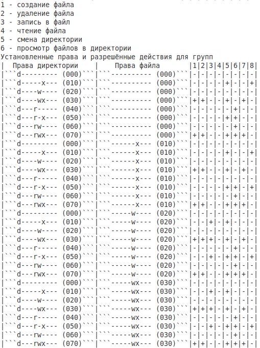
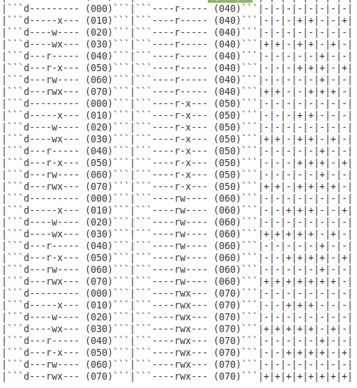
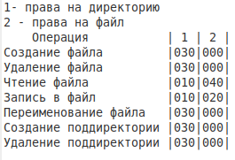

---
## Front matter
title: "Лабораторная работа №3"
subtitle: "Дискреционное разграничение прав в Linux. Два пользователя"
author: "Акопян Изабелла Арменовна"

## Generic otions
lang: ru-RU
toc-title: "Содержание"

## Bibliography
bibliography: bib/cite.bib
csl: pandoc/csl/gost-r-7-0-5-2008-numeric.csl

## Pdf output format
toc: true # Table of contents
toc-depth: 2
lof: true # List of figures
lot: true # List of tables
fontsize: 12pt
linestretch: 1.5
papersize: a4
documentclass: scrreprt
## I18n polyglossia
polyglossia-lang:
  name: russian
  options:
	- spelling=modern
	- babelshorthands=true
polyglossia-otherlangs:
  name: english
## I18n babel
babel-lang: russian
babel-otherlangs: english
## Fonts
mainfont: PT Serif
romanfont: PT Serif
sansfont: PT Sans
monofont: PT Mono
mainfontoptions: Ligatures=TeX
romanfontoptions: Ligatures=TeX
sansfontoptions: Ligatures=TeX,Scale=MatchLowercase
monofontoptions: Scale=MatchLowercase,Scale=0.9
## Biblatex
biblatex: true
biblio-style: "gost-numeric"
biblatexoptions:
  - parentracker=true
  - backend=biber
  - hyperref=auto
  - language=auto
  - autolang=other*
  - citestyle=gost-numeric
## Pandoc-crossref LaTeX customization
figureTitle: "Рис."
tableTitle: "Таблица"
listingTitle: "Листинг"
lofTitle: "Список иллюстраций"
lotTitle: "Список таблиц"
lolTitle: "Листинги"
## Misc options
indent: true
header-includes:
  - \usepackage{indentfirst}
  - \usepackage{float} # keep figures where there are in the text
  - \floatplacement{figure}{H} # keep figures where there are in the text
---

# Цель работы

Получение практических навыков работы в консоли с атрибутами файлов для групп пользователей.

# Задание

 - Создайте учётную запись пользователя guest2

 - Уточните информацию о пользователе

 - Заполните таблицу "Установленные права и разрешённые действия для групп"

 - Заполните таблицу "Минимальные права для совершения операций от имени пользователей входящих в группу"

# Теоретическое введение

В самом начале использую команду useradd, чтобы создать нового пользователя. В Linux команда «useradd» — это утилита низкого уровня, которая используется для добавления/создания учетных записей пользователей в Linux и других Unix-подобных операционных системах. 

В данной лабораторной работе я в основном работаю с командой chmod, это команда для изменения прав доступа к файлам и каталогам.

Есть 3 вида разрешений. Они определяют права пользователя на 3 действия: чтение, запись и выполнение. В Linux эти действия обозначаются вот так:

    - r — read (чтение) — право просматривать содержимое файла;
    - w — write (запись) — право изменять содержимое файла;
    - x — execute (выполнение) — право запускать файл, если это программа или скрипт.

У каждого файла есть 3 группы пользователей, для которых можно устанавливать права доступа. 

    - owner (владелец) — отдельный человек, который владеет файлом. Обычно это тот, кто создал файл, но владельцем можно сделать и кого-то другого.
    - group (группа) — пользователи с общими заданными правами.
    - others (другие) — все остальные пользователи, не относящиеся к группе и не являющиеся владельцами. 

В данной лабораторной мы работаем в основном только с правами для __группы__.

# Выполнение лабораторной работы

Начала с создания нового пользователя. Установила ему пароль. Добавила пользователя guest2 в группу guest, командой gpasswd -a guest2guest. Мне пришлось снова вручную создавать директорию для учетной записи, поэтому передала эту директорию пользователю с помощью команды chmod (рис. @fig:001).

{#fig:001 width=70%}

Далее я работала с командами, с помощью которых проверила имена пользователей, их группу, участников и тд. Также определила командами groups guest и groups guest2, в какие группы входят пользователи guest и guest2. Применила также команды id-Gn и id -G вывод с командой groups практически не отличается, за исключе-нием, что groups выводит группу и кто в неё входит, id -Gn просто выводит пользователей, которые находяться в группе - без названия, а id -G выводит id групп пользователей (рис. @fig:002).

{#fig:002 width=70%}

Просмотрела файл/etc/passwd командой cat /etc/passwd (рис. @fig:003)

{#fig:003 width=70%} 

Здесь я показала скриншот описывающий главную работу с правами доступа и их проверкой. Я меняла права на директорию пользователя guest для групп, и проверяла эти права доступа с пользователя guest2 (рис. @fig:004- @fig:005)

{#fig:004 width=70%} 

{#fig:005 width=70%}  

После такой рутинной работы получила такую таблицу, показанную на рис. @fig:006 -  @fig:007

{#fig:006 width=70%}

{#fig:007 width=70%}

На основании заполненной таблицы выше определила те или иные минимально необходимые права для выполнения пользователем guest2 операций внутри директории dir1 и заполнила таблицу на рис. @fig:008

{#fig:008 width=70%} 

# Выводы

В ходе лабораторной работы мне удалось: получить практические навыки работы в консоли с атрибутами файлов для групп пользователей и заполнить две табицы с правами пользователей в группе.

# Список литературы{.unnumbered}

::: {#refs} :::
