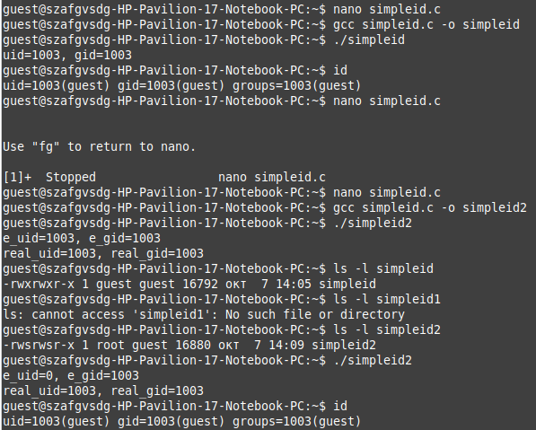
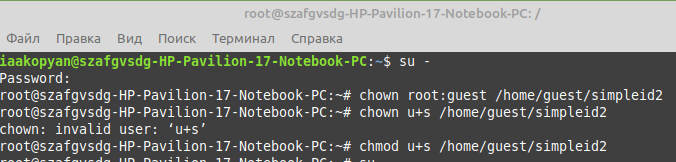
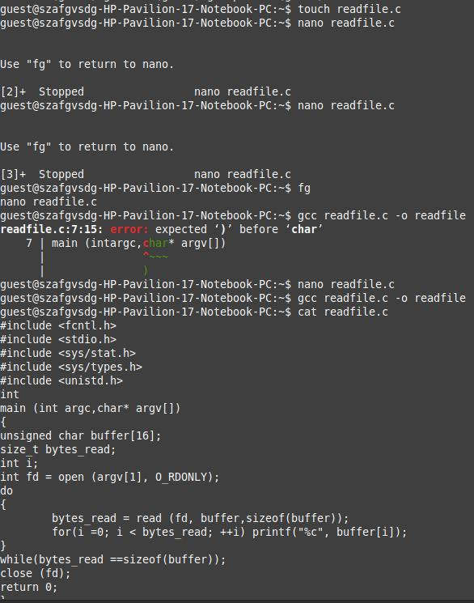
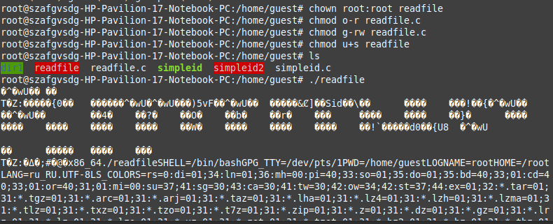
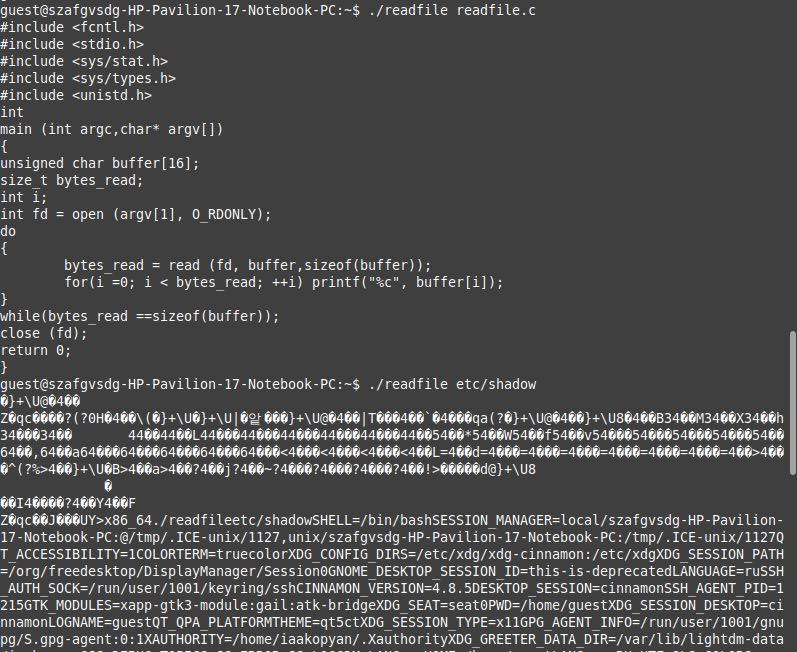
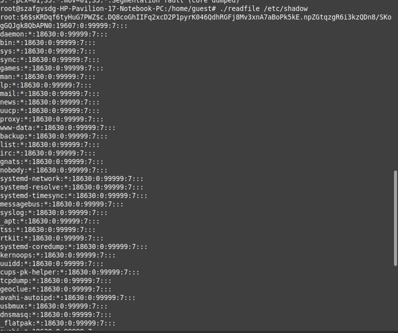
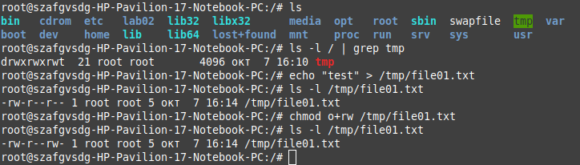
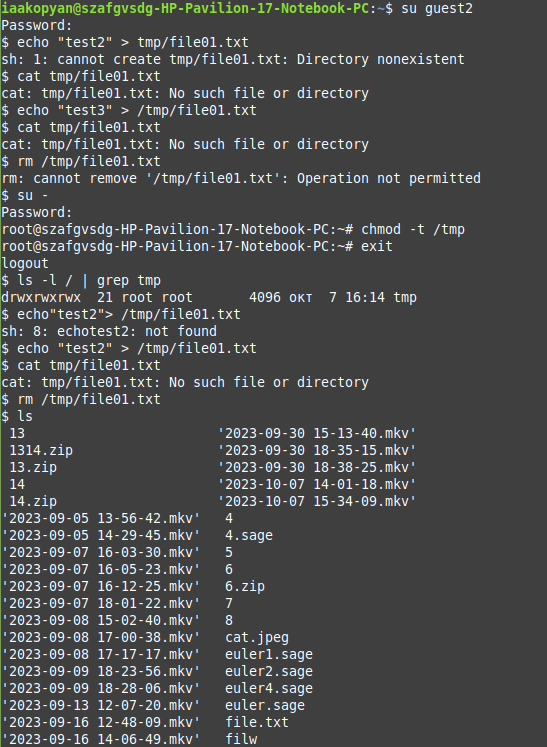
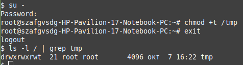

---
## Front matter
lang: ru-RU
title: Лабораторная работа № 5
subtitle: Дискреционное разграничение прав в Linux. Исследование влияния дополнительных атрибутов.
author:
  - Акопян И.А
institute:
  - Российский университет дружбы народов, Москва, Россия
date: 7 октября 2023

## i18n babel
babel-lang: russian
babel-otherlangs: english

## Formatting pdf
toc: false
toc-title: Содержание
slide_level: 2
aspectratio: 169
section-titles: true
theme: metropolis
header-includes:
 - \metroset{progressbar=frametitle,sectionpage=progressbar,numbering=fraction}
 - '\makeatletter'
 - '\beamer@ignorenonframefalse'
 - '\makeatother'
---

# Докладчик

:::::::::::::: {.columns align=center}
::: {.column width="70%"}

  * Акопян Изабелла Арменовна
  * Бизнес-информатика
  * Кафедра математического моделирования и ИИ
  * Российский университет дружбы народов
  * 1032203961@pfur.ru

:::
::: {.column width="30%"}
:::
::::::::::::::

# Цель работы

Изучение механизмов изменения идентификаторов, применения SetUID- и Sticky-битов. Получение практических навыков работы в консоли с дополнительными атрибутами. Рассмотрение работы механизма смены идентификатора процессов пользователей, а также влияние бита Sticky на запись и удаление файлов.    

# Задание

Создать программы,чтобы поработать с битами (SetUID, SetGID, Sticky-бит) и понять как дополнительные атрибуты влияют на работу с файлами.

# Выполнение лабораторной работы

Создали простую программу на языке С для чтения uid и gid. Проверили ее работу, сравнив с системной утилитой id

{#fig:001 width=90%}

# 

{#fig:002 width=90%}

Создали программу для чтения файлов.

# 

{#fig:003 width=40%}

{#fig:004 width=40%}

# 

{#fig:005 width=40%}

{#fig:006 width=40%}

# 

Далее поработали с Sticky-битом

{#fig:007 width=90%}

# 

{#fig:008 width=90%}

# 

Вернула все на место  (см. рис. @fig:009)

{#fig:009 width=90%}

# Выводы

Изучили теорию механизмов изменения идентификаторов, применения SetUID, SetGID и Sticky-битов. Рассмотрела работы механизма смены идентификатора процессов пользователей, а также влияние бита Sticky на запись и удаление файлов.

