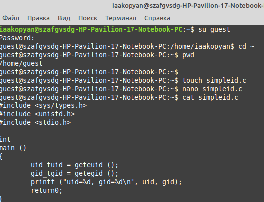
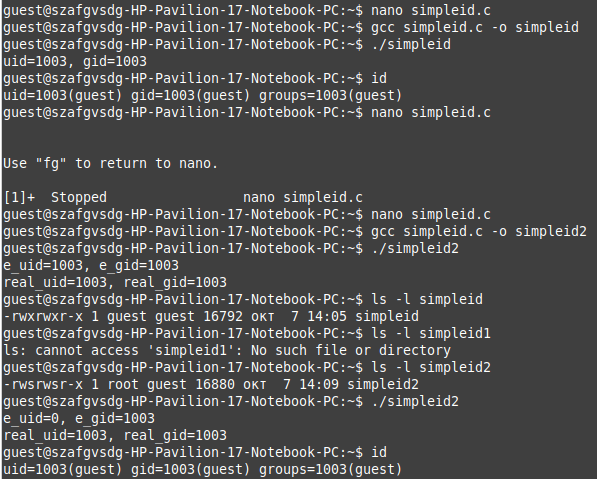
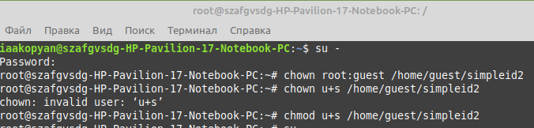
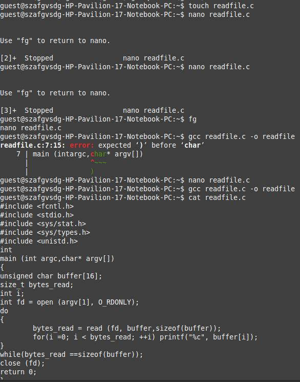
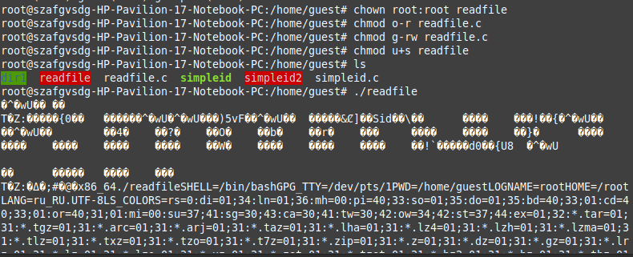
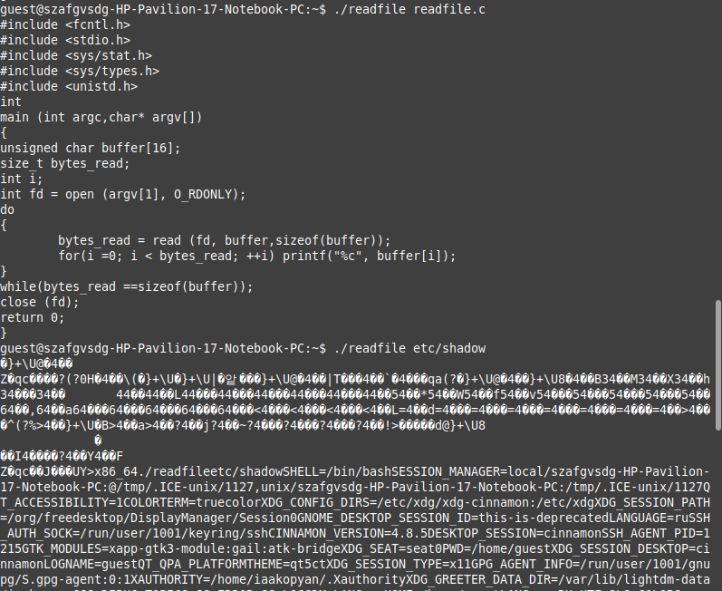
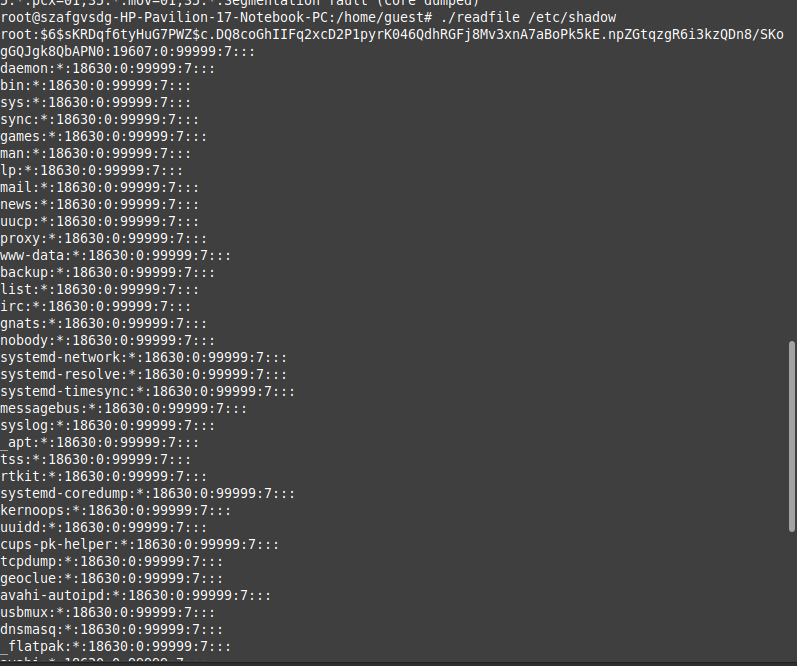
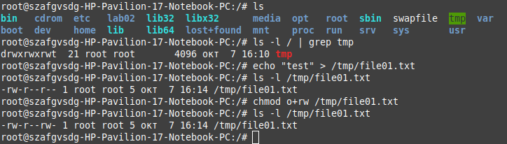
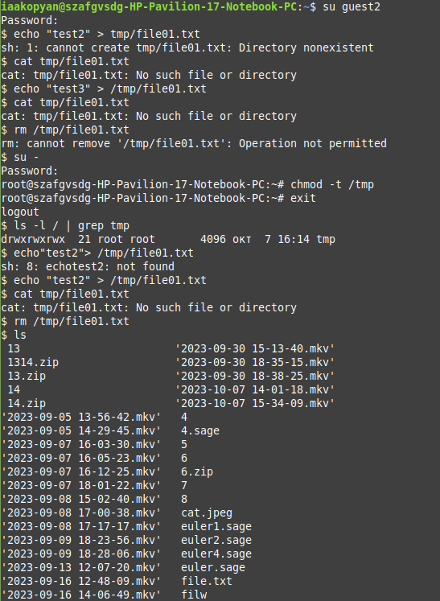
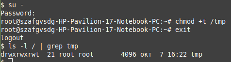

---
## Front matter
title: "Отчёт по лабораторной работе"
subtitle: "Лабораторная работа № 5"
author: "Акопян Изабелла Арменовна"

## Generic otions
lang: ru-RU
toc-title: "Содержание"

## Bibliography
bibliography: cite.bib
csl: pandoc/csl/gost-r-7-0-5-2008-numeric.csl

## Pdf output format
toc: true # Table of contents
toc-depth: 2
lof: true # List of figures
lot: true # List of tables
fontsize: 12pt
linestretch: 1.5
papersize: a4
documentclass: scrreprt
## I18n polyglossia
polyglossia-lang:
  name: russian
  options:
	- spelling=modern
	- babelshorthands=true
polyglossia-otherlangs:
  name: english
## I18n babel
babel-lang: russian
babel-otherlangs: english
## Fonts
mainfont: PT Serif
romanfont: PT Serif
sansfont: PT Sans
monofont: PT Mono
mainfontoptions: Ligatures=TeX
romanfontoptions: Ligatures=TeX
sansfontoptions: Ligatures=TeX,Scale=MatchLowercase
monofontoptions: Scale=MatchLowercase,Scale=0.9
## Biblatex
biblatex: true
biblio-style: "gost-numeric"
biblatexoptions:
  - parentracker=true
  - backend=biber
  - hyperref=auto
  - language=auto
  - autolang=other*
  - citestyle=gost-numeric
## Pandoc-crossref LaTeX customization
figureTitle: "Рис."
tableTitle: "Таблица"
listingTitle: "Листинг"
lofTitle: "Список иллюстраций"
lotTitle: "Список таблиц"
lolTitle: "Листинги"
## Misc options
indent: true
header-includes:
  - \usepackage{indentfirst}
  - \usepackage{float} # keep figures where there are in the text
  - \floatplacement{figure}{H} # keep figures where there are in the text
---

# Цель работы

Изучение механизмов изменения идентификаторов, применения SetUID- и Sticky-битов. Получение практических навыков работы в консоли с дополнительными атрибутами. Рассмотрение работы механизма смены идентификатора процессов пользователей, а также влияние бита Sticky на запись и удаление файлов.    

# Теоретическое введение

Речь пойдет о трех битах – Setuid, Setgid и Sticky Bit. Это специальные типы разрешений позволяют задавать расширенные права доступа на файлы или каталоги.

Setuid – это бит разрешения, который позволяет пользователю запускать испол-няемый файл с правами владельца этого файла. Другими словами, использование этого бита позволяет нам поднять привилегии пользователя в случае, если этонеобходимо. 

Принцип работы Setgid очень похож на setuid с отличием, что файл будет запускаться пользователем от имени группы, которая владеет файлом.

Последний специальный бит разрешения – это Sticky Bit . В случае, если этотбит установлен для папки, то файлы в этой папке могут быть удалены толькоих владельцем. 

В отличие от установки sticky на каталог, на файл такой бит устанавливать уже не имеет смысла. Многие современные ядра попросту игнорируют sticky на файле. На файлах он использовался на старых системах с малой ОЗУ и был очень важен в те времена. Он запрещал выгрузку программ из памяти.

SUID работает только с файлами.
Вы можете применять SGID к каталогам и файлам.
Вы можете применять липкий бит только к каталогам.
Если индикаторы «s», «g» или «t» отображаются в верхнем регистре, исполняемый бит (x) не установлен.

# Выполнение лабораторной работы

Создали простую программу на языке С для чтения uid и gid. Проверили ее работу, сравнив с системной утилитой id (см. рис. @fig:000-@fig:001).      

{#fig:000 width=90%}   


{#fig:001 width=90%}   


Усложнили программу, добавив вывод действительных идентификаторов. Командой ``` chown root:guest /home/guest/simpleid2``` передала права обладания файлов суперпользователю. Присвоила файлу SUID и GUID биты (см. рис. @fig:002). Проверили функционирование. И правда, при выполнении с правами суперпользователя uid указывается суперпользователя  Так как мы не меняли группу файла, изменений в программе при выставлении GUID не наблюдается.   

{#fig:002 width=90%}   

Создали программу для чтения файлов. Установили на текст программы права доступа 000. Установили владельцем исполняемого файла суперпользователя. Поставили SUID бит. Запустили исполняемый файл от обычного пользователя. Исполняемый файл смог прочесть текст программы, у которого отсутствует разрешение для чтения (см. рис. @fig:003-@fig:006).    

{#fig:003 width=90%}   

{#fig:004 width=90%}   

{#fig:005 width=90%}  

{#fig:006 width=90%}  

Далее поработали с Sticky-битом

Создала файл, добавила права остальным пользователям. 

{#fig:007 width=90%}        

От второго гостя попробовала записать в файл текст, удалить файл. Потом убрала атрибут t и сделала все то же самое. (см. рис. @fig:008)

{#fig:008 width=90%}  

Вернула все на место  (см. рис. @fig:009)

{#fig:009 width=90%}  

# Выводы

Изучили теорию механизмов изменения идентификаторов, применения SetUID, SetGID и Sticky-битов. Рассмотрела работы механизма смены идентификатора процессов пользователей, а также влияние бита Sticky на запись и удаление файлов.

# Список литературы{.unnumbered}

::: {#refs} 
:::

