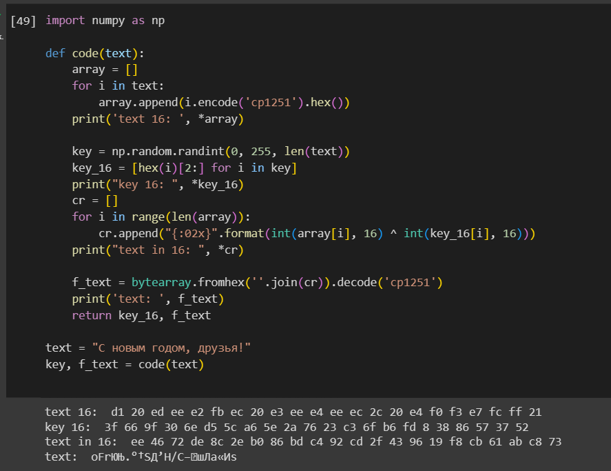
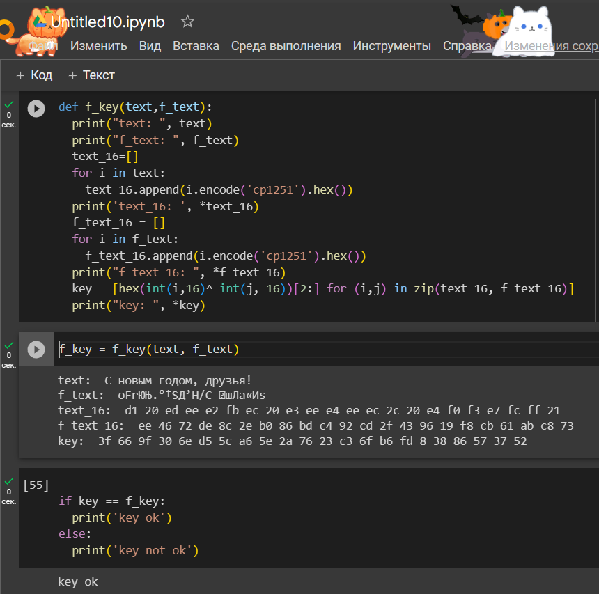

---
## Front matter
lang: ru-RU
title: Элементы криптографии. Однократное гаммирование
author: Акопян Изабелла Арменовна НБИбд 01-20
institute: Российский Университет Дружбы Народов
date: 21 октября, 2023, Москва, Россия

## Formatting
mainfont: PT Serif
romanfont: PT Serif
sansfont: PT Sans
monofont: PT Mono
toc: false
slide_level: 2
theme: metropolis
header-includes: 
 - \metroset{progressbar=frametitle,sectionpage=progressbar,numbering=fraction}
 - '\makeatletter'
 - '\beamer@ignorenonframefalse'
 - '\makeatother'
aspectratio: 43
section-titles: true

---

# Цель работы

Освоить на практике применение режима однократного гаммирования.

1. Создана программа, шифрующая сообщение по ключу.     

2. Создана программа, определяющая ключ по шифру и исходному тексту.    

3. Программа проверена на данных из пособия 

# Задачи для лабораторной работы

Нужно подобрать ключ, чтобы получить сообщение «С Новым Годом,
друзья!». Требуется разработать приложение, позволяющее шифровать и
дешифровать данные в режиме однократного гаммирования. Приложение
должно:

1. Определить вид шифротекста при известном ключе и известном открытом тексте.

2. Определить ключ, с помощью которого шифротекст может быть преобразован в некоторый фрагмент текста, представляющий собой один из
возможных вариантов прочтения открытого текста

# 

{#fig:100 width=99%}

# 

{#fig:200 width=99%}

# Выводы

Я освоила на практике применение режима однократного гаммирования. 