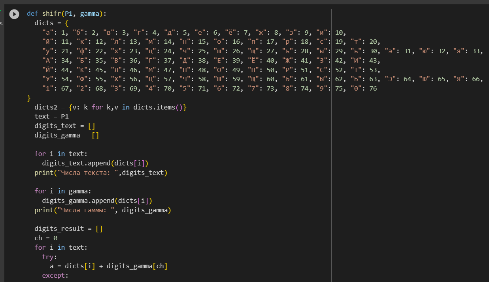
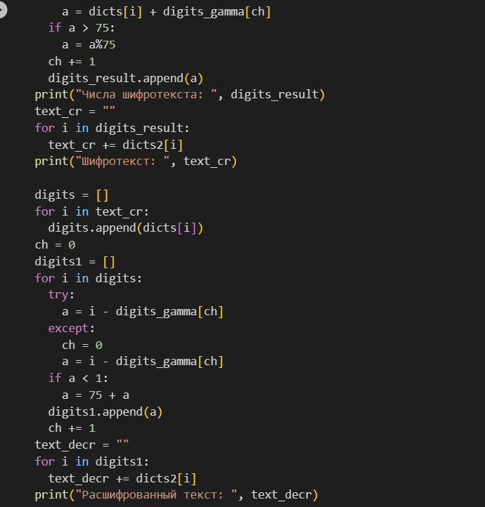
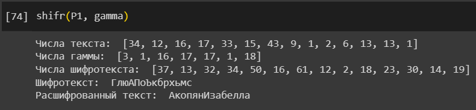
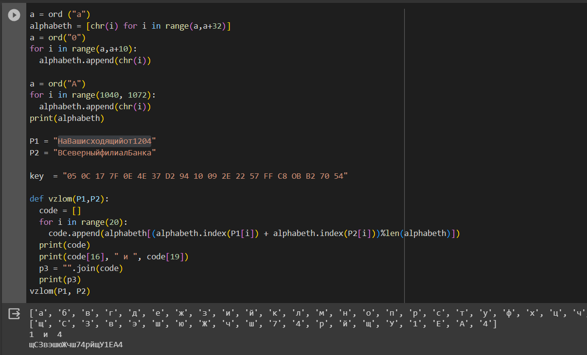

---
## Front matter
title: "Лабораторная работа №8"
subtitle: "Элементы криптографии. Шифрование (кодирование) различных исходных текстов одним ключом"
author: "Акопян Изабелла Арменовна"

## Generic otions
lang: ru-RU
toc-title: "Содержание"

## Bibliography
bibliography: bib/cite.bib
csl: pandoc/csl/gost-r-7-0-5-2008-numeric.csl

## Pdf output format
toc: true # Table of contents
toc-depth: 2
lof: true # List of figures
lot: true # List of tables
fontsize: 12pt
linestretch: 1.5
papersize: a4
documentclass: scrreprt
## I18n polyglossia
polyglossia-lang:
  name: russian
  options:
	- spelling=modern
	- babelshorthands=true
polyglossia-otherlangs:
  name: english
## I18n babel
babel-lang: russian
babel-otherlangs: english
## Fonts
mainfont: PT Serif
romanfont: PT Serif
sansfont: PT Sans
monofont: PT Mono
mainfontoptions: Ligatures=TeX
romanfontoptions: Ligatures=TeX
sansfontoptions: Ligatures=TeX,Scale=MatchLowercase
monofontoptions: Scale=MatchLowercase,Scale=0.9
## Biblatex
biblatex: true
biblio-style: "gost-numeric"
biblatexoptions:
  - parentracker=true
  - backend=biber
  - hyperref=auto
  - language=auto
  - autolang=other*
  - citestyle=gost-numeric
## Pandoc-crossref LaTeX customization
figureTitle: "Рис."
tableTitle: "Таблица"
listingTitle: "Листинг"
lofTitle: "Список иллюстраций"
lotTitle: "Список таблиц"
lolTitle: "Листинги"
## Misc options
indent: true
header-includes:
  - \usepackage{indentfirst}
  - \usepackage{float} # keep figures where there are in the text
  - \floatplacement{figure}{H} # keep figures where there are in the text
---

# Цель работы

Освоить на практике применение режима однократного гаммирования на примере кодирования различных исходных текстов одним ключом.

# Задание

Два текста кодируются одним ключом (однократное гаммирование). Требуется не зная ключа и не стремясь его определить, прочитать оба текста. Необходимо разработать приложение, позволяющее шифровать и дешифровать тексты P1 и P2 в режиме однократного гаммирования.
 Приложение должно определить вид шифротекстов C1 и C2 обоих текстов P1 и P2 при известном ключе ; Необходимо определить и выразить аналитически способ, при котором злоумышленник может прочитать оба текста, не зная ключа и не стремясь его определить.

# Теоретическое введение

Основной принцип действия любого типа кодировки заключается в шифраторе и дешифраторе. С одного устройства информация в конвертированном виде отправляется, 
на другое она поступает и преобразуется в нужный текст. Для кодирования и раскодирования информации потребуется обменяться ключом. Он помогает провести раскодировку письма.
Имеются две большие группы шифров: шифры перестановки и шифры замены.

Шифр перестановки изменяет только порядок следования символов исходного сообщения. Это такие шифры, преобразования которых приводят к изменению только следования символов открытого, исходного сообщения.

Шифр замены заменяет каждый символ кодируемого сообщения на другой(ие) символ(ы), не изменяя порядок их следования. 
Это такие шифры, преобразования которых приводят к замене каждого символа открытого сообщения на другие символы, 
причем порядок следования символов закрытого сообщения совпадает с порядком следования соответствующих символов открытого сообщения.

# Выполнение лабораторной работы

1. Написала приложение, позволяющее шифровать и дешифровать тексты P1 и P2 в режиме однократного гаммирования (рис. @fig:001 - @fig:002).     
Она определяет вид шифротекстов C1 и C2 обоих текстов P1 и P2 при известном ключе

{#fig:001 width=80%}

{#fig:002 width=80%}

Ниже показан результат работы приложения ( рис. @fig:003)

{#fig:003 width=80%}

2. Взяла тексты из задания лабораторной работы и запустила программу ( рис. @fig:004)

{#fig:004 width=80%}

# Выводы

Я овладела навыками использования режима однократного гаммирования на практике, применяя его для кодирования разнообразных исходных текстов с 
использованием одного и того же ключа.
Мною было разработано приложение, которое способно зашифровывать и расшифровывать тексты в режиме однократного гаммирования, а также определять 
тип шифротекста при наличии известного ключа.

# Список литературы{.unnumbered}

::: {#refs}
:::
